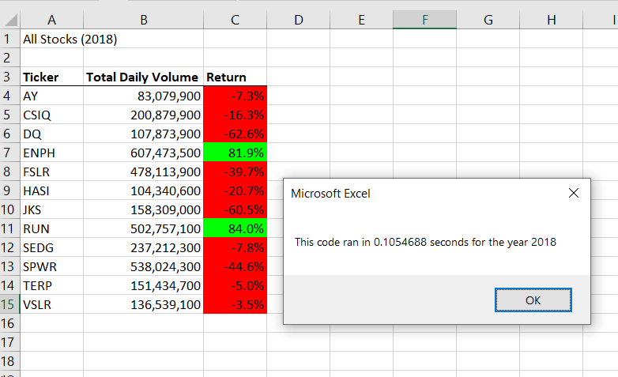

# stock-analysis
## Overview of Project
Steve’s parents are passionate about green energy. They believe that as fossil fuels get used up, there will be more and reliance on alternative energy production. There are many forms of green energy stocks to invest in, including hydroelectricity, wind energy, geothermal energy, and bioenergy. However, Steve’s parents haven’t done much research and have instead decided to invest all their money into Daqo New Energy Corporation a company that makes silicon wafer for solar panels. Steve wants to advise them properly so he wants to run some data and check DQ stocks in 2017 and 2018 to compare with other companies.
## Results
The tables contains a Ticker, Total Daily Volume and Return. The ticker shows the stock symbol for the company. The total daily volume shows the total number of shares that are traded in a specific time. The return shows the money made or lost on an investment over periof of time.
As you can see, the only 2 stocks that did good were ENPH and RUN in 2017 and 2018. Sadly,the investment Steve's parents did in DQ had a significant loss in 2018.
## Elapsed time for 2017 and 2018 REFACTORED

## Elapsed time for 2017 and 2018 ORIGINAL

The refactored code now runs faster than the orininal as you can see in the pictures 
### What are the advantages or disadvantages of refactoring code?
The advantage to refactoring is that makes the code more efficient and it helps to understand and read better.
The only disadvantage I see to refactoring is that it can be time consuming 
### How do these pros and cons apply to refactoring the original VBA script?

The pros is that having a larger data improve the speed to run it faster. The cons is that the code had to be debugged multiple times in order to run properly.
